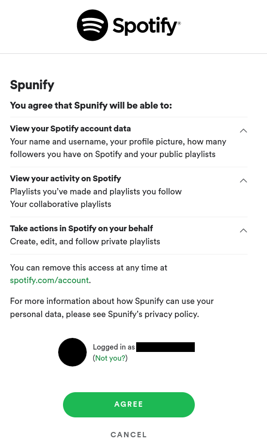

# Spunify

A Python script to unify Spotify playlists into a single destination playlist.

## Usage

```man
usage: spunify [-h] [-v | -vv] -d DESTINATION -s SOURCES [SOURCES ...]

Merge spotify playlists

options:
  -h, --help            show this help message and exit
  -v, --verbose         Increase verbosity
  -vv, --very-verbose   Increase verbosity further
  -d DESTINATION, --destination DESTINATION
                        The ID, URI, or URL of the playlist where the tracks will be merged
  -s SOURCES [SOURCES ...], --sources SOURCES [SOURCES ...]
                        The URLs, URIs, or IDs of the playlists to be merged into the destination
```

## Requirements

- Python 3.7 or newer.

- [Spotipy](https://github.com/plamere/spotipy/).

- a Spotify account.

- a [Spotify for Developers](https://developer.spotify.com/dashboard/) account,
  with a Client ID setup for this project.

## Installation

```bash
# Clone the repo
git clone https://github.com/fdioguardi/spunify/ && cd spunify

# Setup and activate a virtual environment
if python -m venv .venv && source .venv/bin/activate; then
  # Upgrade pip
  python -m pip install --upgrade pip

  # Get dependencies
  pip install -r requirements.txt
fi
```

## Setup

1. Register a new app on yous [Spotify for Developers](https://developer.spotify.com/dashboard/)
   account.

2. Replace the Client ID in [`spunify/credentials.py`](spunify/credentials.py)
   with the Client ID of your new app.

3. Match the Redirect URI in your Spotify's app with the Redirect URI in [`spunify/credentials.py`](spunify/credentials.py)
   (you can use any valid URL).

4. Run the application as shown in [Usage](#usage) and grant it the [required permissions](#authorization-scopes).
   You will only need to do this once.



## Authorization scopes

The first time you run the application, Spotify will ask you to authorize this operations:

- [playlist-modify-private](https://developer.spotify.com/documentation/general/guides/authorization/scopes/#playlist-modify-private/)
- [playlist-read-collaborative](https://developer.spotify.com/documentation/general/guides/authorization/scopes/#playlist-read-collaborative/)
- [playlist-read-private](https://developer.spotify.com/documentation/general/guides/authorization/scopes/#playlist-read-private/)

Spunify needs this permissions to get the tracks/episodes on the playlists
(`playlist-read-collaborative` and `playlist-read-private`)
and to update the destination playlist
(`playlist-modify-private`, which also implies
[`playlist-modify-public`](https://developer.spotify.com/documentation/general/guides/authorization/scopes/#playlist-modify-public/)).

To change the scopes, edit [`spunify/credentials.py`](spunify/credentials.py).

## Cool projects

- [@lucadp19](https://github.com/lucadp19/)'s [SpotifyPlaylistUnion](https://github.com/lucadp19/SpotifyPlaylistUnion/)

- [@JMPerez](https://github.com/JMPerez)'s [spotify-dedup](https://github.com/JMPerez/spotify-dedup/)
